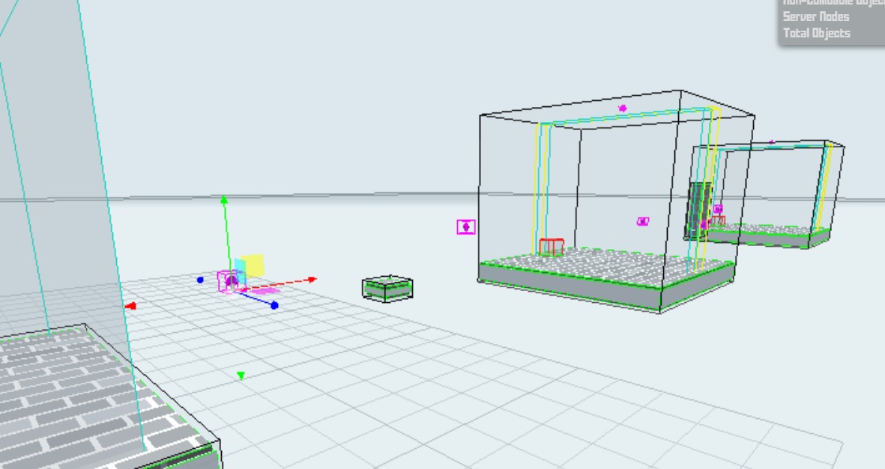

# Doublejump with crystals
Video example:

https://streamable.com/3qu3k8

What it looks like in the editor:

  

# Instructions to place crystals
1. Place object->tools->path node into the map
2. Make sure every path node has unique ID
3. Test! you should have a new crystal
